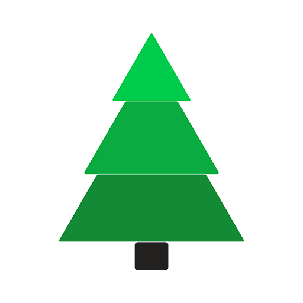

<p align="center">
  <a href="https://github.com/AjayLiu/ajayliu.com">
    
  </a>

  <h3 align="center">Verde</h3>

  <p align="center">
    A social media app where users upload photos of themselves completing fun sustainability challenges!
</p>

<!-- TABLE OF CONTENTS -->
<details open="open">
  <summary>Table of Contents</summary>
  <ol>
    <li>
      <a href="#about-the-project">About The Project</a>
      <ul>
        <li><a href="#built-with">Built With</a></li>
      </ul>
    </li>
    <li>
      <a href="#getting-started">Getting Started</a>
      <ul>
        <li><a href="#prerequisites">Prerequisites</a></li>
        <li><a href="#installation">Installation</a></li>
        <li><a href="#development">Development</a></li>
        <li><a href="#deployment">Deployment</a></li>
      </ul>
    </li>
    <li><a href="#license">License</a></li>
    <li><a href="#contact">Contact</a></li>
    <li><a href="#acknowledgements">Acknowledgements</a></li>
  </ol>
</details>

<!-- ABOUT THE PROJECT -->

## About The Project

<!-- </img> -->

</img>

This app is a collaborative project between Ajay Liu ([@ajayliu](https://github.com/ajayliu)), Rohil Shah ([@rohildshah](https://github.com/rohildshah)), Will Corcoran ([@wrcorcoran](https://github.com/wrcorcoran)), and Nikhil Vyas ([@nikhilvyas109](https://github.com/nikhilvyas109)) for the [2023 Google Developer Student Club Solution Challenge](https://developers.google.com/community/gdsc-solution-challenge)

### Built With

- [React Native](https://reactnative.dev/)
- [Firebase](https://firebase.google.com/)
- [Expo](https://expo.dev/)

<!-- GETTING STARTED -->

## Getting Started

Here is a guide if you want to clone the project and modify it for yourself, all the way to deployment.

### Prerequisites

- [yarn](https://yarnpkg.com/)
- [git](https://git-scm.com/)

### Installation

1. Clone the repo
   ```sh
   git clone https://github.com/AjayLiu/verde-app-expo.git
   ```
2. Install packages
   ```sh
   yarn
   ```
3. Create a `.env` or `.env.local` file in the root of the project and copy your Firebase config information. This can be found via https://console.firebase.google.com/project/[YOUR APP NAME]/settings/general
   ```
    FIREBASE_API_KEY=
    FIREBASE_AUTH_DOMAIN=
    FIREBASE_PROJECT_ID=
    FIREBASE_STORAGE_BUCKET=
    FIREBASE_MESSAGING_SENDER_ID=
    FIREBASE_APP_ID=
    FIREBASE_MEASUREMENT_ID=
   ```

### Development

To run the development server

```sh
yarn start
```

Then use expo's Expo Go app to test or through the Android or iOS emulators (Mac only).

### Deployment

1. Publish the app via Expo's EAS system.

<!-- LICENSE -->

## License

Distributed under the MIT License. See `LICENSE` for more information.

<!-- CONTACT -->

## Contact

Ajay Liu - contact@ajayliu.com

https://github.com/AjayLiu/verde-app-expo

<!-- ACKNOWLEDGEMENTS -->

## Acknowledgements
- [UCSB Google Developer Student Club](https://gdsc.community.dev/university-of-california-santa-barbara-ca/)
- [Authentication Flow Tutorial](https://blog.logrocket.com/integrating-firebase-authentication-expo-mobile-app/)
- [Camera Flow Tutorial](https://www.freecodecamp.org/news/how-to-create-a-camera-app-with-expo-and-react-native/)
